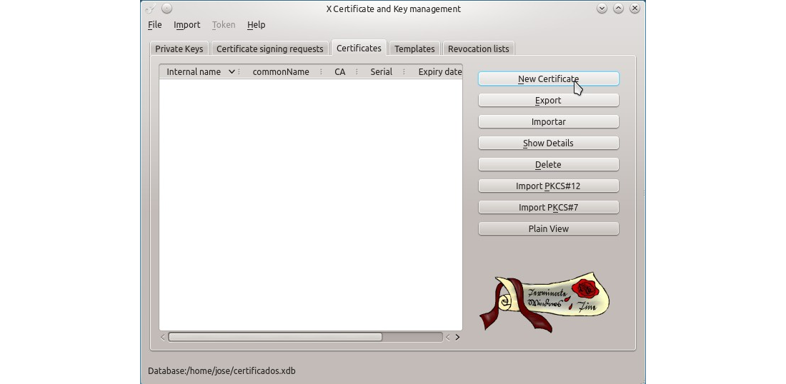
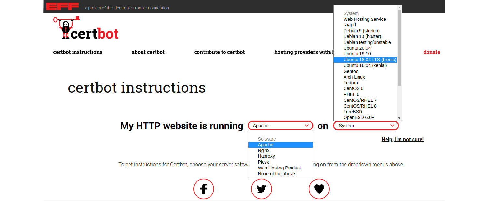
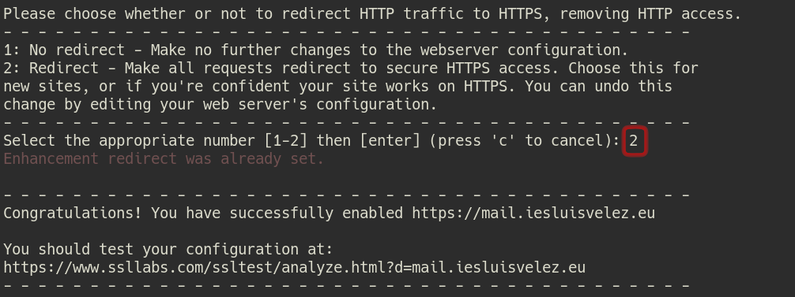
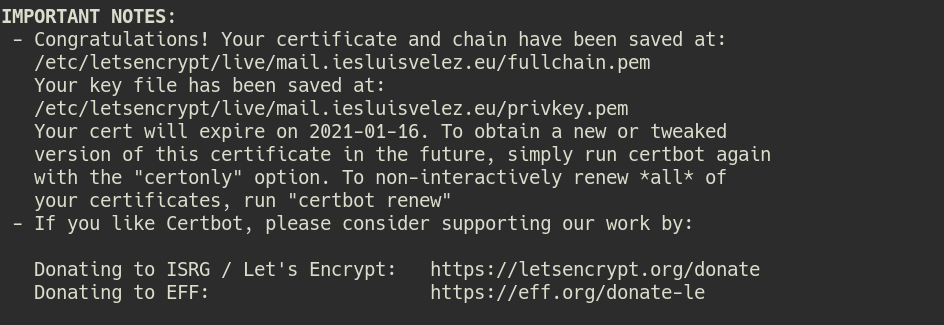

<!---
Ejemplos de inserción de videos

<video class="stretch" controls><source src="http://clips.vorwaerts-gmbh.de/big_buck_bunny.mp4" type="video/mp4"></video>
<iframe width="560" height="315" src="https://www.youtube.com/embed/3RBq-WlL4cU" frameborder="0" allowfullscreen></iframe>

slide: data-background="#ff0000" 
element: class="fragment" data-fragment-index="1"
-->

## Despliegue de aplicaciones web
---

<p><small> IES Luis Vélez de Guevara - Écija - Spain </small></p>


## Servidores web

[](http://creativecommons.org/licenses/by-sa/4.0/)


## Índice
--- 
- ### Introducción
- ### Apache: Instalación
- ### Apache: Hosts virtuales
- ### Apache: Autenticación básica
- ### Apache: Servidor HTTPS 

<!--- Note: Nota a pie de página. -->


## Introducción


### En esta Unidad aprenderemos a

- Reconocer los parámetros de administración más importantes del servidor Web.
- Crear y configurar sitios virtuales.
- Establecer mecanismos para asegurar las comunicaciones entre el cliente y el servidor.
- Realizar los ajustes necesarios para la implantación de aplicaciones en el servidor Web.


## Apache: Instalación

**`apt  install  apache2`**


### Características

- Apache2 es el servidor web más usado actualmente.
- Es **software libre**.
- Tiene un **diseño modular**. 
- Directorio de configuración principal: **`/etc/apache2`**.
- Archivo de configuración principal: **`apache2.conf`**.
- Módulos en:
  - **`mods-available`** (disponibles)
  - **`mods-enabled`** (habilitados)
- Sitios en:
  - **`sites-available`** (disponibles)
  - **`sites-enabled`** (habilitados)


### Archivos y carpetas

```
├── apache2.conf
├── conf-available
│   └── localized-error-pages.conf
├── conf-enabled
├── envvars
├── magic
├── mods-available
│   ├── ssl.conf
│   └── ssl.load
├── mods-enabled
│   ├── ssl.conf -> ../mods-available/ssl.conf
│   └── ssl.load -> ../mods-available/ssl.load
├── ports.conf
├── sites-available
│   ├── 000-default.conf
│   └── default-ssl.conf
└── sites-enabled
    └── 000-default.conf -> ../sites-available/000-default.conf
```


### Gestión del servicio

```bash
systemctl  start   apache2  # service apache2 start
systemctl  restart apache2  # service apache2 restart
systemctl  stop    apache2  # service apache2 stop
systemctl  status  apache2  # service apache2 status

systemctl  enable  apache2  
systemctl  disable apache2  
```


### Comandos

```bash 
a2dismod   # Deshabilitar módulo 
a2enmod    # Habilitar módulo

a2dissite  # Deshabilitar sitio
a2ensite   # Habilitar sitio
```


## Apache: Hosts virtuales


### Características

- Apache2 permite tener varios sitios web compartiendo una dirección IP.
- Sitio por defecto en **`/var/www/html`**.
- Otros sitios virtuales en:
  - **`/var/www/sitio1`**, **`/var/www/sitio2`**, ...
- Por cada sitio virtual debe existir un archivo de configuración.
- Dicho archivo debe alojarse en:
  - **`/etc/apache2/sites-available`**  


### Archivo de configuración

**`/etc/apache2/sites-available/sitio.conf`**

```xml
<VirtualHost *:80> 
  ServerName www.sitio.com
  ServerAdmin webmaster@sitio.com
  DocumentRoot /var/www/sitio

</VirtualHost>
```


### Comandos

```bash
a2dissite  sitio           # Deshabilita sitio
a2ensite   sitio           # Habilita sitio
service  apache2  restart  # Reinicia el servidor
```


### Resolución de nombres

- Cuando escribimos una URL en el navegador, ésta debe ser traducida a una IP.
- Este procedimiento se conoce como resolución de nombres.
- Lo habitual es que se encargue el servicio DNS.
- Pero una solución rápida para pruebas, es editar el archivo **`/etc/hosts`**.

```
192.168.1.135   www.sitio.com
192.168.1.135   www.moodle.com
```


## Apache: Autenticación básica


### Características

- El usuario debe identificarse para acceder a un sitio o carpeta.
- Credenciales de usuario/contraseña.
- La constraseña se guarda cifrada en un archivo al que tiene acceso Apache.
- Para cifrar, usamos el comando **`htpasswd`**.
- Indicamos mediante directivas el tipo de autenticación y usuarios permitidos.
- El tráfico no viaja cifrado. No es un mecanismo muy seguro. 
- Actualmente se usa poco.


### Comandos

```bash
mkdir     /var/www/passwd   # creamos directorio
cd        /var/www/passwd   # entramos en directorio
touch     .htpasswd         # creamos archivo
htpasswd  .htpasswd  jose   # añadimos usuario jose
```

Note: Ejecutar los comandos como usuario **root**.


### Directivas de autenticación

```xml
<VirtualHost *:80> 
  ServerName www.sitio.com 
  ServerAdmin webmaster@localhost 
  DocumentRoot /var/www/sitio

  <Directory /var/www/sitio> 
    AuthType Basic
    AuthName "Zona Privada"
    AuthUserFile /var/www/passwd/.htpasswd
    Require user jose juan
  </Directory>
</VirtualHost>
```


## Apache: Servidor HTTPS


### Características

- Necesita de un **certificado X.509**.
- Dos tipos de certificados:
  - **Autofirmados**.
  - **Firmados por una CA** (Autoridad de Certificación).
- Permite que el tráfico viaje cifrado.
- Adicionalmente también permite autenciación si el certificado está firmado por una CA reconocida.
- HTTPS = HTTP + SSL/TLS

Note: Actualmente, mediante **SNI** (https://es.wikipedia.org/wiki/Server_Name_Indication), es posible que un servidor utilice múltiples certificados en una misma dirección IP y número de puerto.


### Archivo de configuración

**`/etc/apache2/sites-available/default-ssl.conf`**

```xml
<VirtualHost _default_:443> 
  ServerName nombre­-dominio-­sitio
  DocumentRoot /var/www/html
  
  SSLEngine on

  SSLCertificateFile  /etc/ssl/certs/nombre-­sitio.pem
  # SSLCertificateKeyFile /etc/ssl/private/nombre-sitio.key
  ...
  
  <Directory /var/www/html> 
    SSLRequireSSL
    ...
  </Directory>
</VirtualHost>
```

Note: Es posible almacenar tanto el certificado como la clave privada en el mismo archivo. 


### Comandos

```bash
a2enmod   ssl                # Habilitamos módulo SSL
 
a2ensite  default-ssl        # Habilitamos sitio default-ssl

systemctl  restart  apache2  # Reiniciamos Apache
```


### Obtener un certificado X.509

**Podemos emplear al menos 4 formas**

- **`make-ssl-cert`** (**muy básica**, terminal de texto)
- **`openssl`** (**potente**, terminal de texto)
- **`xca`** (**cómoda**, aplicación gráfica)
- **`cerbot`** (**moderna**, permite certificados firmados por una CA)


### make-ssl-cert

```bash
make-­ssl-­cert  /usr/share/ssl­-cert/ssleay.cnf  /etc/ssl/private/nombre­-sitio.pem
```

Note: El ejecutable `make-ssl-cert` viene en el paquete `ssl-cert`


### openssl

```terminal
# Generamos clave privada
openssl genrsa -out key 1024

# Generamos CSR y firmamos con nuestra clave privada
openssl req -new -key key -out csr
openssl x509 -req -days 365 -in csr -signkey key -out crt

# Copiamos clave y certificado en el destino
cat key crt > /etc/ssl/private/nombre-sitio.pem
```

Note: CSR = Certificate Signing Request (solicitud de firma de certificado).

Note: Las palabras `key`, `csr` y `crt` representan aquí nombres de archivo que he escogido para simplificar.


### xca (I)

- Es una aplicación gráfica que nos permite la creación de certificados digitales.




### xca (II)

**Instrucciones de uso para crear un certificado autofirmado**

0. Crear una base de datos que guardará las claves y los certificados.
1. Crear un par de claves pública-privada.
2. Crear un certificado digital y firmar con la clave privada.


### certbot

- **Bot para la gestión de certificados de Let's Encrypt**
- **Es necesario disponer de un dominio registrado**
- https://certbot.eff.org/


#### Preliminares (I)

- Si usamos instancias EC2 de AWS podemos crear un par de claves pública-privada.
- La descargamos a nuestro PC. 


#### Preliminares (II)

- Y realizaremos una conexión SSH usando la clave privada descargada a nuestro PC.


#### Instalación de certbot

https://certbot.eff.org/instructions



- Seleccionamos la plataforma del servidor.
- Seguiremos las instrucciones de instalación.


#### Ejecución de certbot

- Previamente debemos haber configurado nuestros sitios virtuales.
- En este ejemplo aparecen dos sitios virtuales.


#### Paso 1: activación HTTPS


#### Paso 2: redirección HTTP a HTTPS




#### Paso 3: felicidades


