<!---
Ejemplos de inserción de videos

<video class="stretch" controls><source src="http://clips.vorwaerts-gmbh.de/big_buck_bunny.mp4" type="video/mp4"></video>
<iframe width="560" height="315" src="https://www.youtube.com/embed/3RBq-WlL4cU" frameborder="0" allowfullscreen></iframe>

slide: data-background="#ff0000" 
element: class="fragment" data-fragment-index="1"
-->

## HLC - PHP
---

<p><small> IES Luis Vélez de Guevara - Écija - Spain </small></p>


## Programación estructurada

[](http://creativecommons.org/licenses/by-sa/4.0/)


## Índice (I)
--- 
- ### Algoritmos y ordinogramas
- ### Entorno de desarrollo
- ### Entrada y salida
- ### Tipos de datos


## Índice (II)
--- 
- ### Estructuras alternativas
- ### Estructuras repetitivas
- ### Arrays
- ### Funciones 

<!--- Note: Nota a pie de página. -->


## Introducción


### En esta Unidad aprenderemos a

- Diferenciar algoritmo y programa.
- Identificar mediante ordinograma un algoritmo.
- Reconocer los tipos de datos básicos.
- Trabajar con variables y constantes.
- Trabajar con estructuras de control alternativas y repetitivas.
- Trabajar con funciones.


## Algoritmos y ordinogramas

**Algoritmo**

Secuencia de pasos para resolver un determinado problema.

**Ordinograma**

Representación gráfica de un algoritmo.


### Algoritmos

- Son independiente del lenguaje de programación.
- Deben trasladarse a un lenguaje de programación.
- Se pueden representar mediante:
  - Pseudocódigo
  - Ordinogramas


### Tipos de datos

- Simples
  - **ENTEROS**:  ```-3    0    994```
  - **REALES**:   -```3.01   3.14    0.001```
  - **LÓGICOS o BOOLEANOS**: ```Verdadero    Falso```
  - **CARÁCTER**:  ```'A'    '2'    '@'    '-' ```
  - **CADENA**:  ```"C/ Nueva, 1"```
- Compuestos
  - **ARRAY**
  - **OBJETO**


## Constantes y Variables

**Constante** 

Dato guardado en memoria que no cambia de valor.

**Variable**

Dato guardado en memoria que puede cambiar de valor.


### Símbolos de un Ordinograma

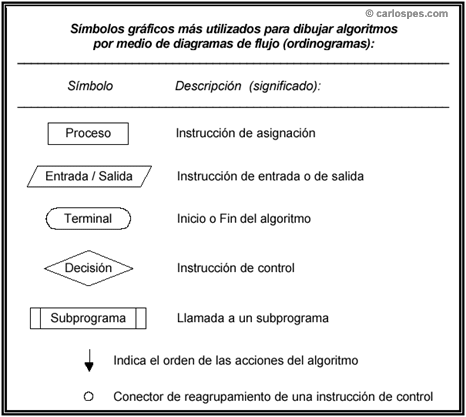


### Ejemplo de un ordinograma


### Primitivas básicas

**Asignación**


**Entrada**


**Salida**


### Expresiones aritméticas

- Es aquella cuyo valor es un número entero o real.
- Ejemplos:
  - 3 + 5
  - 2.01 * 3
  - (2.1 - 10)/2


### Operadores aritméticos

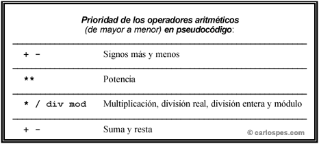


### Expresiones lógicas

- Es aquella cuyo valor es *Verdadero* o *Falso*.
- Está compuesta de datos y **operadores relacionales y lógicos**
- Ejemplos:
  - 3 > 5
  - (5 > 2) y (3 >= 1)
  - ((5 > 2) y (3 >= 1)) o (0 <> 1)


### Operadores relacionales

También llamados **operadores de comparación**

- **>** Mayor que
- **>=** Mayor o igual que
- **<** Menor que
- **<=** Menor o igual que
- **==** Igual que
- **<>**,  **!=** Distinto que


### Operadores lógicos

- **y**
- **o**
- **no**


### Operadores relacionales y lógicos

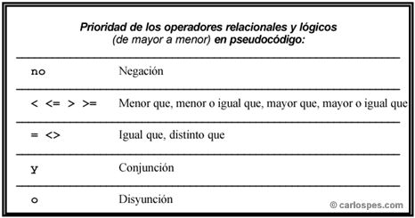


### Prioridad de los operadores

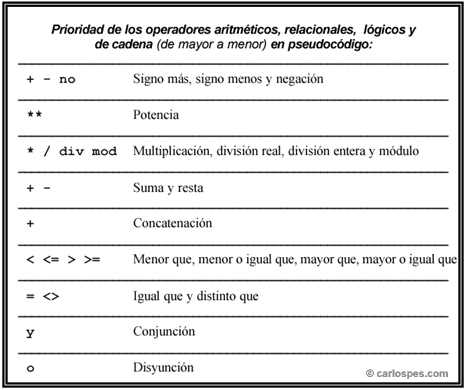


### Estructuras alternativas

- Permiten **ejecutar código dependiendo de si se cumple o no una condición**.
- Las principales estructuras son:
  - **Alternativa doble**
  - **Alternativa simple**
  - **Alternativa múltiple**


#### Alternativa doble

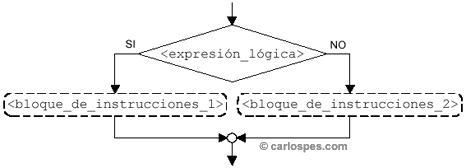


#### Alternativa simple

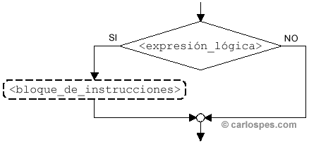


#### Alternativa múltiple

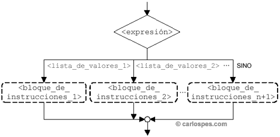


### Estructuras repetitivas

- Permiten **ejecutar código varias veces**.
- Las principales estructuras son:
  - **Repetitiva mientras**
  - **Repetitiva hacer ... mientras**
  - **Repetitiva para**


#### Repetitiva mientras

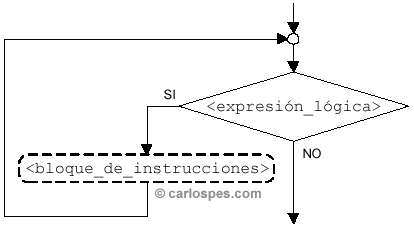


#### Repetitiva hacer ... mientras

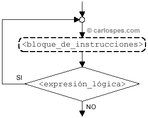


#### Repetitiva para

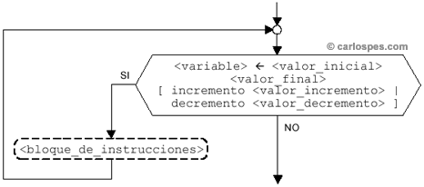


## Entorno de desarrollo

- S.O. LUbuntu
- Lenguaje PHP


### Instalación de PHP

- Para instalar el lenguaje PHP, ejecutamos:

```bash
sudo  apt  install  php
```

Note:  php es el intérprete para los programas escritos en este lenguaje.


### Ejecutar sentencias en modo interactivo

```bash
php  -a
```

```php
php > echo "Hola mundo";
```

Note: Pulsar `Ctrl+D` para salir del intérprete.


### Ejecutar sentencias en un script

```php
<?php
// holamundo.php

echo "Hola mundo\n";

?>
```

```bash
php  holamundo.php
```


### Comentarios

- Los comentarios **no se ejecutan**.
- Sólo sirven para hacer más entendible el código fuente.
- Existen **2 tipos**

**De una sola línea**
```php
echo "Hola\n";  // Un mensaje por pantalla
echo "Hola\n";  # El mismo mensaje por pantalla

```

**De varias líneas**
```php
/*
Programa super corto.
Muestra un mensaje por pantalla.
*/
echo "Hola\n";
```


## Entrada y salida

- **PHP es un lenguaje para programación web**.
- La principal sentencia para la **salida** de datos es **echo**
- El principal método para la **entrada** de datos es el uso de **Formularios HTML**


### Salida de datos (I)

- Las principales sentencias para salida de datos son:
  - **echo**  (permite varios argumentos separados por comas)
  - **print** (solo permite un argumento)

```php
echo  "Hola", 32, "Adiós", true;
print "Hola";
```


### Salida de datos (II)

- También existen 2 funciones:
  - **print_r**  (información escueta)
  - **var_dump** (información detallada)
- Suelen usarse para mostrar datos compuestos como los arrays.

```php
$frutas = ["manzana", "naranja", "fresa"];

print_r  ($frutas);
var_dump ($frutas);
```


### Entrada de datos

- La entrada de datos mediante **el uso de formularios HTML se verá en el Bloque temático de Programación web**.
- Aunque es poco conocido y usado, **PHP también permite la entrada de datos desde el terminal de texto**.
- Para realizar entrada por terminal usamos la función **fgets**

```php

echo "Introduce tu edad: ";
$edad = (int) fgets (STDIN);
```

Note: STDIN es la entrada estándar, es decir el teclado.
(int) es un *casting* para convertir la entrada en formato texto a entero.


## Tipos de datos


### Variables (I)

- Los principales tipos de datos para variables y constantes en PHP son:
  - **boolean**: *true*, *false*
  - **integer** o **int**:  enteros
  - **float** o **double**: reales
  - **string**: texto

```php
// Declaración de variables

$abierto = true; 
$edad = 15;
$altura = 1.62;
$nombre = "Ana López";
```


### Variables (II)

- Los tipos de datos compuestos son:
  - **array**: lista de varios valores
  - **object**: objeto (se verán el el Bloque de Programación orientada a objetos)

```php
$frutas = ["manzana", "naranja", "fresa"];  // ARRAY

class Persona {                             // CLASE ("Plantilla de objeto")
  // Propiedades
  private $nombre    = null;
  private $apellidos = null;
  
  // Constructor:
  function __construct($nombre, $apellidos) {
    $this->nombre    = $nombre;
    $this->apellidos = $apellidos;
  }
}
$pepe = new Persona ("José", "García");     // OBJETO
```


### Variables (III)

- Podemos ver el tipo de una variable o constante mediante la función **gettype**

```php 
echo gettype ($abierto);  // boolean
echo gettype ($edad);     // integer
echo gettype ($altura);   // double
echo gettype ($nombre);   // string
echo gettype ($frutas);   // array
echo gettype ($pepe);     // object 
```


### Variables (IV)

- Para eliminar una variable usamos la función **unset**
- Para comprobar si una variable existe usamos la función **isset**

```php
unset ($edad);

if (isset($edad)) 
  echo "La variable existe"; 
else 
  echo "La variable no existe"; // se muestra este mensaje
```


### Constantes

- Por convención **se escriben en MAYÚSCULAS**
- En PHP hay que usar la función **define**
- Una vez inicializada, su valor no puede cambiarse.

```php
define ("ABIERTO", true); 
define ("PI", 3.14);
define ("SALUDO", "Buenos días");

echo gettype (ABIERTO);
echo gettype (PI);
echo gettype (SALUDO);

echo 2*PI;
```


### Operadores aritméticos

- **+** Suma
- **-** Resta
- ** \* ** Multiplicación
- **/** Cociente
- **%** Resto (también llamado módulo)
- ** \*\* ** Exponenciación


### Operadores relacionales

También llamados **operadores de comparación**

- **>** Mayor que
- **>=** Mayor o igual que
- **<** Menor que
- **<=** Menor o igual que
- **==** Igual valor que (igualdad)
- **===** Igual valor y tipo que (identidad)
- **<>**,  **!=** Distinto valor que (desigualdad)
- **!==** Distinto valor y tipo que (no identidad)


### Operadores lógicos

- **and**, **&&**  
- **or**, **||**
- **!**


## Estructuras alternativas


### Alternativa doble (I)

**Ordinograma**

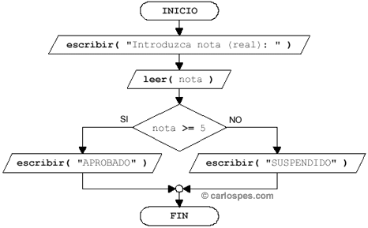


### Alternativa doble (II)

**Script PHP**
```php
<?php

echo "Introduzca nota: ";
$nota = (double) fgets (STDIN);

if ($nota >= 5)   
  echo "APROBADO" . "\n";
else
  echo "SUSPENDIDO" . "\n";

?>
```


### Alternativa simple (I)

**Ordinograma**

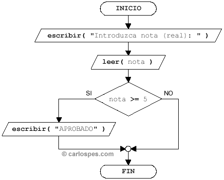


### Alternativa simple (II)

**Script PHP**
```php
<?php

echo "Introduzca nota: ";
$nota = (double) fgets (STDIN);

if ($nota >= 5)   
  echo "APROBADO" . "\n";

?>
```


### Alternativa múltiple (I)

**Ordinograma**

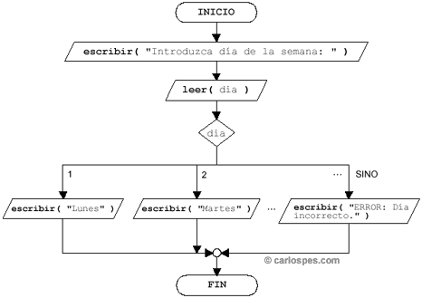


### Alternativa múltiple (II)

**Script PHP**
```php
<?php

echo "Introduzca día de la semana (1 - 7): ";
$dia = (int) fgets (STDIN);

switch ($dia) {
  case 1:  echo "Lunes\n";     break;
  case 2:  echo "Martes\n";    break;
  case 3:  echo "Miércoles\n"; break;
  case 4:  echo "Jueves\n";    break;
  case 5:  echo "Viernes\n";   break;
  case 6:  echo "Sábado\n";    break;
  case 7:  echo "Domingo\n";   break;
  default: echo "ERROR: Día incorrecto\n"; 
}
 
?>
```


## Estructuras repetitivas


### Repetitiva while (I)

**Ordinograma**

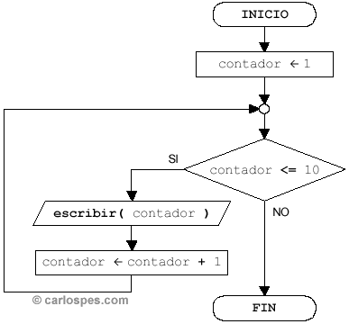


### Repetitiva while (II)

**Script PHP**
```php
<?php

$contador = 1;

while ($contador <= 10) {
  echo $contador . "\n";
  $contador++;
}

?>
```


### Repetitiva do ... while (I)

**Ordinograma**

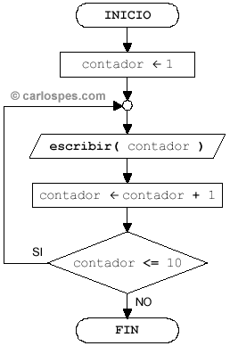


### Repetitiva do ... while (II)

**Script PHP**
```php
<?php

$contador = 1;

do {
  echo $contador . "\n";
  $contador++;
} while ($contador <= 10)

?>
```


### Repetitiva for (I)

**Ordinograma**

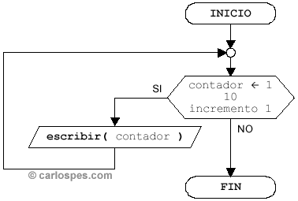


### Repetitiva para (II)

**Script PHP**
```php
<?php

for ($contador = 1; $contador <= 10; $contador++) {
  echo $contador . "\n";
}

?>
```


### Repetitiva foreach

- Se utiliza para recorrer arrays.

```php
<?php

$frutas = ["manzana", "naranja", "fresa"];

foreach ($frutas as $fruta) {
  echo $fruta . "\n";
}

?>
```


## Arrays

- **Dato compuesto por una lista de elementos**
- **PHP permite que los elementos tengan distinto tipo**
- Los Objetos son otro tipo de dato compuesto que se verán en el Bloque temático de Programación Orientada a Objetos.


### Declaración de un array

```php
$numeros = array(1, 3, 5);

$cosas   = array("hola", 4, 2.5); 
```

Forma simplificada
```php
$numeros = [1, 3, 5];

$cosas   = ["hola", 4, 2.5]; 
```


### Mostrar un array completo 

- Usamos las funciones **`print_r`** y **`var_dump`**
- La función `var_dump` muestra más información ya que muestra el tipo de cada elemento.

```php
print_r  ($cosas);
var_dump ($cosas);
```


### Acceso a un elemento del array

- Podemos ver y modificar un elemento concreto del array.
- Para ello accedemos a través del índice dentro del array.
- **El primer elemento tiene un índice 0**

```php
// Para mostrar un elemento del array
echo  $cosas[0];      // Muestra hola
echo  $cosas[1];      // Muestra 4

// Para modificar un elemento del array
$cosas[0] = "Adiós"; 
$cosas[1] = "Pepe";
``` 


### Añadir un elemento a un array

```php
$cosas[] = "Coche";   // Añade el elemento al final del array

print_r ($cosas);       
```

Se muestra
```
Array
(
    [0] => Adiós
    [1] => Pepe
    [2] => 2.5
    [3] => Coche
)
```


### Eliminar un elemento de un array

```php
unset ($cosas[2]);

print_r ($cosas);
```

Se muestra
```
Array
(
    [0] => Adiós
    [1] => Pepe
    [3] => Coche
)
```


### Recorrido de un array

El bucle más adecuado para recorrer un array es el bucle `foreach`

```php
foreach ($cosas as $cosa) {
  echo $cosa;
  echo "\n";
} 
```

Aunque también podemos utilizar el bucle `for`

```php
for ($i = 0; $i < count($cosas);  $i++) {
  echo $cosas[$i];
  echo "\n";
}
```


### Tipos de arrays

- **Indexados**. Los vistos anteriormente.
- **Asociativos**. 
- **Multidimensionales**. 


### Array asociativo

**Se accede a cada elemento mediante una clave en lugar de usar un índice.**

```php
$capitales = ["España" => "Madrid", "Francia" => "París", "Italia" => "Roma" ];

// Accedemos a cada elemento por una clave, en lugar de usar un índice
echo $capitales["España"];  // Madrid
echo $capitales["Francia"]; // París
echo $capitales["Italia"];  // Roma

// Podemos recorrer con foreach
foreach ($capitales as $capital) 
  echo "$capital, ";  // Madrid, París, Roma

foreach ($capitales as $clave => $valor) 
  echo "$clave : $valor. ";  // España : Madrid. Francia : París. Italia : Roma.
```


### Array multidimensional

**Permite que cada elemento sea a su vez un array.**

```php
// Lista de coches y sus precios
$coches = array (
  array("Volvo", 32000),
  array("BMW", 40000),
  array("Dacia", 10000)
);

echo $coches[0][0];  // Marca del primer coche
echo $coches[0][1];  // Precio del primer coche

echo $coches[1][0];  // Marca del segundo coche
echo $coches[1][1];  // Precio del segundo coche
```


### Strings y Arrays (I)

- Las cadenas tipo `string` pueden considerarse un array de caracteres.
- Podemos acceder y cambiar un caracter de un string como si fuese un array.

```php
$nombre = "Federico";
echo $nombre[0];    // F
echo $nombre[1];    // e
```


### Strings y Arrays (I)

- Pero no podemos utilizar el bucle `foreach` para recorrer los caracteres que tiene el `string`.
- Para `string` debemos usar un bucle `for`.

```php
// ERROR
foreach ($nombre as $letra) 
  echo $letra;

// CORRECTO
for ($i=0; $i < strlen($nombre); $i++) 
  echo $nombre[$i] . "\n";
```


## Funciones 


### Funciones matemáticas

**Operaciones con números**

```php
$num1    = -12.349;
$num2    =  12.349;
$numeros = [3.14, 4, 9, 0, -5];

echo abs  ($num1);     // 12.349  (valor absoluto)
echo round($num1);     // -12     (redondeo)
echo round($num1, 2);  // -12.35  (redondeo a 2 decimales)
echo floor($num1);     // -13     (número entero por abajo)
echo floor($num2);     // 12      (número entero por abajo)
echo ceil ($num1);     // -12     (número entero por encima)
echo ceil ($num2);     // 13      (número entero por encima)
echo sqrt ($num2);     // 3.51... (raíz cuadrada)

echo rand();          // (número aleatorio 0 .. muchos millones)
echo rand(10,100);    // (numero aleatorio 10 .. 100)

echo min($numeros);   // -5       (mínimo número de un array)
echo max($numeros);   // 9        (máximo número de un array)
```


### Funciones de cadenas (I)

**Operaciones con texto**

```php
$texto1 = "  hola  ";
$texto2 = "fin";
$texto3 = "hola mundo";

echo ltrim     ($texto1);  // "hola  " (elimina espacios por la izquierda)
echo rtrim     ($texto1);  // "  hola" (elimina espacios por la derecha)
echo trim      ($texto1);  // "hola"   (elimina espacios a derecha e izquierda)

echo strlen    ($texto2);  // 3     (longitud del string)
echo strtolower($texto2);  // "fin" (pone en minúsculas)
echo strtoupper($texto2);  // "FIN" (pone en mayúsculas)
echo strrev    ($texto2);  // "nif" (invierte la cadena)

echo ucfirst   ($texto3);  // "Hola mundo" (Upper Case First)
echo ucwords   ($texto3);  // "Hola Mundo" (Upper Case Words)
```


### Funciones de cadenas (II)

```php
$palabras = ["Hello", "World"];

// "mun" (devuelve a partir de la posición 5, 3 caracteres)
echo substr($texto3, 5, 3);      

// 1 (cuantas veces aparece un substring) 
echo substr_count($texto3, "ll");  

// "hola Raimundo"  (sustituye a partir de la posición 5, 0 caracteres con Rai, es decir inserta)
echo substr_replace($texto3, "Rai", 5, 0);

// "Hello World"      (convierte array a string)
echo     implode(" ", $palabras);  

// ["Hello", "World"] (convierte string a array)  
print_r (explode(" ", $texto3));  
```

- Más funciones para cadenas en https://www.php.net/manual/es/book.strings.php


### Funciones de fecha y hora (I)

**Formatos**

``` 
l    Día de la semana
d    Día del mes
m    Mes en número
F    Mes en texto
M    Mes en texto (3 primeras letras)
y    Año (2 cifras)
Y    Año (4 cifras)
h    Hora, formato 12h
H    Hora, formato 24h
i    Minutos
s    Segundos

e    Zona horaria
P    Diferencia de zona respecto a Greenwich
```

- Más formatos en https://www.php.net/manual/es/function.date.php


### Funciones de fecha y hora (II)

**Ejemplos**

```php
echo time ();           // Tiempo en segundos desde 1 Enero 1970
echo strtotime ("now"); // Igual al anterior 

echo date ("l d F Y  H:i:s e P");         // Fecha y hora actual
echo date ("l d F Y  H:i:s e P", time()); // Igual al anterior

echo date ("l d F Y  H:i:s", strtotime("+1 week 2 days 4 hours 2 seconds"));  
echo date ("l", strtotime("10 September 2000"));
echo date ("l d F Y", strtotime("next Thursday"));
echo date ("l d F Y", strtotime("last Monday"));
```


### Funciones de trabajo con archivos (I)

**Funciones básicas**

```
fopen     Abrir archivo
fclose    Cerrar archivo

feof      End Of File

fgets     Leer línea de texto del archivo
fputs     Escribir línea de texto del archivo
```


### Funciones de trabajo con archivos (II)

**Ejemplo: Escribir en archivo de texto**

```php
// Escribir en archivo de texto
$archivo = fopen("test.txt","w");  // w: Sólo escritura

fputs($archivo, "Primera línea\n");
fputs($archivo, "Segunda línea\n");

fclose($archivo);
```


### Funciones de trabajo con archivos (III)

**Ejemplo: Leer de archivo de texto**

```php 
// Leer de archivo de texto
$archivo = fopen("test.txt", "r");  // r: Sólo lectura

// Mostrar líneas hasta End Of File
while(! feof($archivo)) {
  $linea = fgets($archivo);
  echo $linea;
}

fclose($archivo);
```


### Otras funciones

```php
sleep(3);        // parada de 3 segundos
usleep(3000000); // parada de 3 segundos (3000000 microsegundos)
```


### Funciones definidas por el usuario (I)

- También podemos **definir nuestras propias funciones**.
- Ejemplo de **definición de funciones** aritméticas:

```php
// Archivo   funciones.php
function  suma  ($a, $b) {  // $a y $b son parámetros formales
  return  $a + $b;
}

function  resta  ($a, $b) {
  return  $a - $b;
}
// ...
```


### Funciones definidas por el usuario (II)

- Luego, podemos **usar las funciones definidas** previamente.
- Ejemplo de **llamada a funciones** aritméticas:

```php
// indicamos que vamos a hacer uso de funciones.php
include "funciones.php";  
 
//  2 y 3 son parámetros reales (también llamados argumentos)
echo suma (2, 3);  
echo resta (2, 3);
```


### Programación modular (I)

- Permite tener variables, constantes y funciones en varios archivos.
- Para hacer uso de ellas debemos indicarlo mediante una de las siguientes opciones:
  - `include`
  - `require`
  - `include_once`
  - `require_once`


### Programación modular (II)

**Ejemplos**

```php
// si funciones.php no existe, no se produce error
include "funciones.php";  
// si funciones.php no existe, se produce error
require "funciones.php"; 
 
// Las siguientes sentencias, son iguales a las anteriores,
// salvo que el archivo se incluye una sola vez.
// Es muy útil en proyectos muy grandes, donde 
// la inclusión de un archivo podría producirse en varios sitios. 
include_once "funciones.php";  
require_once "funciones.php";  
```
