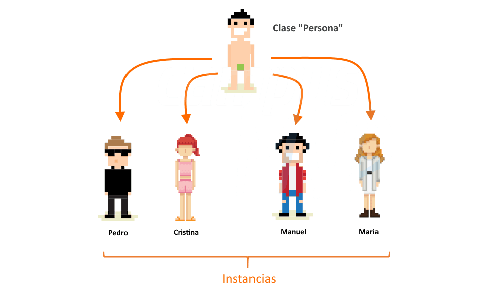
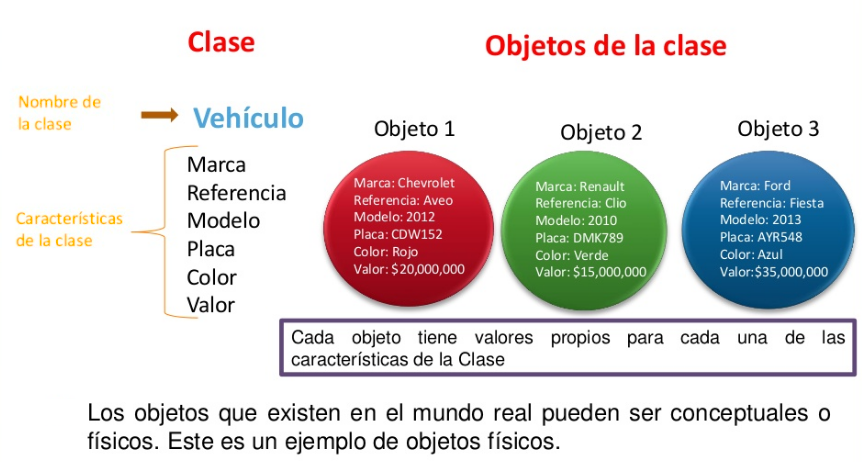
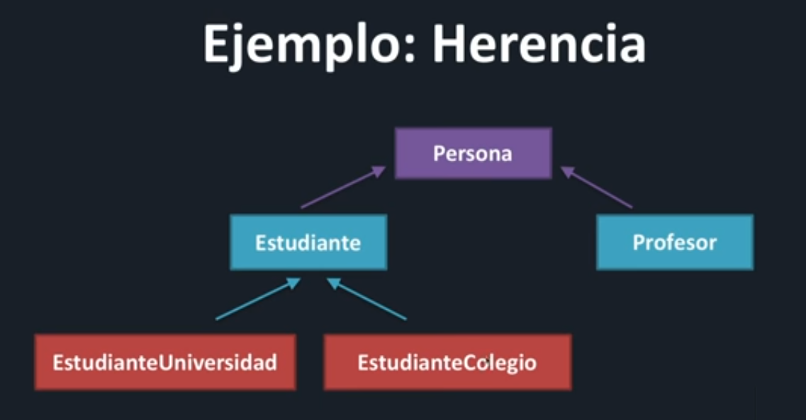

<!---
Ejemplos de inserción de videos

<video class="stretch" controls><source src="http://clips.vorwaerts-gmbh.de/big_buck_bunny.mp4" type="video/mp4"></video>
<iframe width="560" height="315" src="https://www.youtube.com/embed/3RBq-WlL4cU" frameborder="0" allowfullscreen></iframe>

slide: data-background="#ff0000" 
element: class="fragment" data-fragment-index="1"
-->

## HLC - PHP
---

<p><small> IES Luis Vélez de Guevara - Écija - Spain </small></p>


## Programación orientada a objetos

[](http://creativecommons.org/licenses/by-sa/4.0/)


## Índice
--- 
- ### Introducción
- ### POO: Clases y objetos
- ### Encapsulación
- ### Propiedades y métodos
- ### Herencia
- ### Instanciación

<!--- Note: Nota a pie de página. -->


## Introducción


### En esta Unidad aprenderemos a

- Distinguir el concepto de clase y el concepto de objeto. 
- Crear clases.
- Instanciar objetos a partir de la clase creada.
- El concepto de encapsulación y los distintos tipos de modificadores de acceso.
- Trabajar con propiedades y métodos.
- El concepto de herencia.


## POO: Clases y objetos

**Programación Orientada a Objetos**


### Conceptos

- La POO es un paradigma de programación.
- En POO organizamos los datos y el código en unidades llamadas **clases**.
- La POO pretende utilizar abstracciones más próximas a la forma de pensar del ser humano. 


### Clases y objetos (I)

- Una **clase** es una *plantilla* que representa una categoría de la realidad.
- Los **objetos** son instancias de alguna clase, es decir, concreciones de una categoría.


### Clases y objetos (II)




## Encapsulación


### Conceptos

- Mediante la **encapsulación** hacemos que todos los datos y funciones relacionadas se guarden en un único lugar. Dicho lugar es la **clase**.
- **Los datos almacenan el estado, y las funciones proporcionan el comportamiento**.
- Se oculta el estado, es decir, los datos solo son accesibles a través de las funciones.
- El aislamiento protege a los datos contra su modificación involuntaria.


### Estado y comportamiento (I)

- Cada objeto guarda su propio estado, asignando valores a sus propiedades.




### Estado y comportamiento (II)

**Estructura de una clase en PHP**

```php
class Clase {
  /* PROPIEDADES o ATRIBUTOS. 
     Guardan el estado de cada objeto.
     Se implementan mediante variables.
  */
  
  /* MÉTODOS
     Proporcionan el comportamiento de cada objeto
     Se implementan mediante funciones.
  */   
}
```


### Modificadores de acceso

- TIPOS:
  - **public**: se puede acceder a la propiedad o al método desde cualquier lugar. Si no se indica nada, este es la situación por defecto.
  - **protected**: se puede acceder a la propiedad o método dentro de la clase y mediante clases derivadas de esa clase
  - **private**: SOLO se puede acceder a la propiedad o al método dentro de la clase


## Propiedades y métodos


### Definición de clase (Ejemplo)

```php
// Archivo Persona.php
class Persona {
  // Propiedades (define el estado)
  private $nombre = null;
  private $edad   = null;
   
  // Métodos (define el comportamiento) 
  public function __construct ($nombre, $edad) {
    $this->nombre = $nombre;
  }

  public function saluda (){
    echo "Hola, me llamo $this->nombre\n";
  }
}
```
Note: Las **propiedades** suelen tener acceso **privado**. Los **métodos** suelen tener acceso **público**


### Métodos especiales

- **__construct**: **Constructor**. Inicializa el objeto.
- **__destruct**: **Destructor**. Libera recursos del objeto.
- **__toString**: Muestra información de un objeto.

```php
  public function __construct ($nombre, $edad) {
    $this->nombre = $nombre;
    $this->edad   = $edad;
  }

  public function __destruct () {
    echo "\nObjeto ($this->nombre, $this->edad) eliminado\n" ;
  }

  public function __toString () {
    return "\nNombre: $this->nombre, Edad: $this->edad \n";
  }
```


### Métodos getter y setter

- Métodos **getter**: devuelven el valor de una propiedad
- Métodos **setter**: dan valor a una propiedad

```php
  // MÉTODO GETTER
  public function getNombre () {
    return $this->nombre;
  }

  // MÉTODO SETTER
  public function setNombre ($nombre) {
    $this->nombre = $nombre;
  }
```

- Dentro de la clase usamos `$this->lo_que_sea` para acceder a propiedades y métodos de dicha clase.
- Su uso no es obligatorio.
- Suele usarse con propiedades, cuando queremos distinguir éstas de un párametro con el mismo nombre.


### Otros métodos

- Cualquier otro método que nosotros definamos para proporcionar comportamiento a la clase.

```php
  public function saluda (){
    echo "Hola, me llamo $this->nombre\n";
  }

  public function camina (){
    echo "Estoy caminando ...\n";
  }
```


### Propiedades y métodos estáticos (I)

- Se indican con la palabra reservada **`static`**
- Los métodos estáticos sólo pueden hacer uso de propiedades estáticas.

```php
class Persona  {
  private static $cantidad = 0; 

  public function __construct ($nombre, $edad) {
    self::$cantidad++;
  }

  public static function getCantidad(){
    return self::$cantidad;
  }
}
```

Note: Dentro de la clase usamos `$self::lo_que_sea` para acceder a propiedades y métodos **estáticos** de una clase.


### Propiedades y métodos estáticos (II)

- No es necesario crear objetos para poder usarlos.

```php
// colegio.php
echo "\nHay " . Persona::getCantidad() . " persona(s)\n";
```

Note: Fuera de la clase usamos `$Clase::lo_que_sea` para acceder a propiedades y métodos **estáticos** de una clase, siempre que sean públicos.


### Namespaces

- Para **organizar el código** usamos `namespaces`.
- Un `namespace` es algo semejante a un paquete en Java y define un contexto.
- Evita que haya colisiones de nombres cuando un mismo nombre de clase aparece en distintos contextos.
- Ejemplo de namespace:

```php
<?php
namespace Colegio\Gestion;

class Persona {
  // ...
}
?>
```


## Herencia




### Conceptos

- La herencia nos permite la **reutilización de clases**.
- Podemos crear clases derivadas a partir de una **clase base**, también llamada **superclase**.
- Las clases derivadas se denominan **clases hija**. Estas clases *extienden* la funcionalidad de la clase base. 


### Creación de una clase hija 

- Usamos la palabra clave `extends`

```php
<?php
// Archivo Estudiante.php
include_once "Persona.php";

use Colegio\Gestion\Persona;

class Estudiante extends Persona {
  private $curso = null;

  function __construct($nombre, $edad, $curso)
  {
    parent::__construct($nombre, $edad);
    $this->curso = $curso;
  } 
}
?>
```


### Usando nuestra clase

- En proyectos con muchos archivos usamos `include_once` para no incluir un mismo archivo múltiples veces.
- Hacemos uso de sentencia `use ...` para usar la clase deseada.

```php
<?php
// Archivo colegio.php
include_once "Estudiante.php";

use Colegio\Gestion\Estudiante;

$ana = new Estudiante ("Ana María", 12, "2º ESO A");
?>
```


## Instanciación


### Conceptos

- instanciación de objetos = creación de objetos.
- Un objeto se instancia con el operador `new` ...
- ... y el constructor de la clase.
- El constructor inicializa el objeto, es decir, establece un estado inicial.


### Ejemplos

```php
$pepe = new Persona ("José Antonio", 40);
$ana  = new Persona ("Ana María", 20);
$juan = new Persona ("Juan Carlos", 30);

$roberto = new Profesor ("Roberto", 30, "Lengua");
$ana     = new Estudiante ("Ana María", 12, "2º ESO A");

echo $pepe; // muestra el texto devuelto por __toString
echo $ana;  // muestra el texto devuelto por __toString 
```